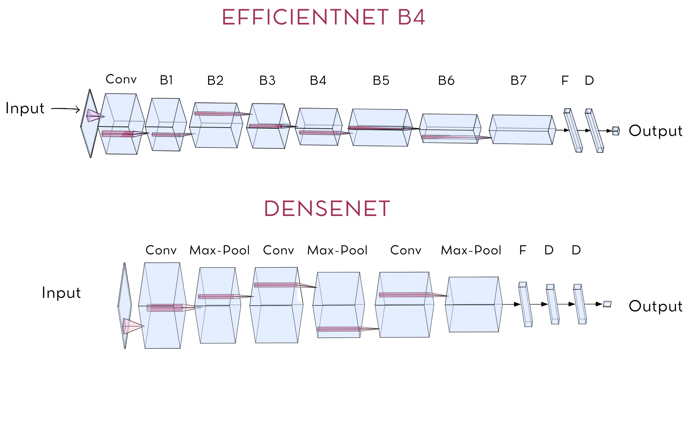

<h1 style="text-align: center;"> Automated Stroke Classification through Convolutional Neural Networks: A Comprehensive Analysis of Blood Clot Images for Improved Treatment Prescription  </h1>
<h3 style="text-align: center;"> IRONHACK - Final project </h3>
<h4 style="text-align: center;"> Sara del Carmen Benítez-Inglott González </h4>

## State of the Art

An ischemic stroke occurs when a blood clot, known as a thrombus, plugs or blocks an artery which supplies the brain. As a result, the blood flow is restricted, not allowing the gas exchange and nutrition of the organs and tissues [[1](https://my.clevelandclinic.org/health/articles/17060-how-does-the-blood-flow-through-your-heart)]. This happens in critical and risky situations, when the blood blockage reaches the brain. At first, when the tissue is deprived of supply, cells begin to die; however, as time goes on, the likelihood of experiencing a stroke increases, which can lead to permanent brain damages or even death [[2](https://www.ncbi.nlm.nih.gov/pmc/articles/PMC10112237/#:~:text=Mortality%20in%20the%20first%2030,on%20early%20treatment(11).)].

## Stroke Blood Clots: Molecular Biology Overview

A blood clot is a partially solid mass that usually forms within blood vessels and is made up of blood cells and other biological cellular components. Even though it is the main cause of strokes, it is important to remember that clot formation frequently has a positive function: it stops tissue bleeding when injury occurs [[4](https://my.clevelandclinic.org/health/body/17675-blood-clots)].

Regarding its composition, blood clots contains mainly: red blood cells (RBCs), fibrin(proteins), platelets (cells from the bone marrow) and white blood cells (WBCs) [[5](https://www.ncbi.nlm.nih.gov/pmc/articles/PMC6910231/)], which later we will talk about.

## Dataset

For this work, a ischemic stroke dataset from [Kaggle - Mayo Clinic](https://www.kaggle.com/competitions/mayo-clinic-strip-ai/code?competitionId=37333&searchQuery=cnn) was used. 

This dataset contains:
- Three folders: 
    - train/ - a folder containing .tif images, used to train the model
    - test/ - a folder containing .tif images used as a test data, to test the model accuracy and error.
    - other/ - a supplemental folder containing .tif images with either unknown etilogy or an etilogy other than CE or LAA. 
- Three csv files: 
    - train.csv: containing annotations for images in the train/ folder.
    - test.csv: containing annotations for images in the test/ folder. Has the same columns as the train.csv except for the label classification. 
    - other.csv: contains annotations for images in the other/ folder. Has the same columns as test.csv

  | image-id | center-id | patient-id | image_num | label |
  |:--------:|:---------:|:----------:|:---------:|:-----:|
  | 00638_0  |    11     |   00638    |     0     |  CE   |

The **two** major acute ischemic stokes etilogy subtypes and object of study are: 
1. Cardiac embolism (CE)
2. Large Artery Atherosclerosis (LAA).

All samples in this dataset underwent staining with Martius Scarlet Blue (MSB), a distinctive stain known for imparting vibrant colors to the main cellular components, as illustrated in the image below:

<small> Figure 1. Histologic samples of cardio embolic (left) and atherosclerotic patients. RBCs: Red blood cells; WBCs: White blood cells; P: Platalets; F: Fibrin
</small>

While the etiologies initially appear distinct from each other, a closer examination reveals subtle variations in cellular components. Despite their apparent differences, these etiologies exhibit nuanced distinctions in terms of their cellular composition:

| etiology | RBCs    | WBCs   | P      | F      |
|:--------:|:-------:|:------:|:-----:|:------:|
| CE       | 47.67%  | 4.22%  | 18.21% | 29.19% |
| LAA      | 42.58%  | 3.12%  | 20.81% | 31.31% |

## Aim 

Due to these subtle percentage differences, human visual classification of stroke etiologies becomes impractical. To address this challenge, a Convolutional Neural Network (CNN) is employed for its ability to discern intricate patterns and variations in the stained cellular components, providing a more accurate and efficient classification.

## Pipeline
This is the Workflow that I've been following this last week

  

### Decision-making 
The initial phase of this project, preceding the coding process, involved a comprehensive understanding of the image content. The decisions made during the pre-processing stage played a pivotal role in ensuring the development of a high-accuracy model. These decisions included:

1. **Rescaling Images:** Given the substantial pixel count in each image, rescaling was necessary. To achieve this, a standarization process was implemented, mapping pixel values from 0 (representing black) to 1 (representing white). The standarization factor of 255, denoting white in the original image, was applied.

An example of the differences between performing a normalization and a standarization on an image:

  

2. **Preserving Color Composition:** Acknowledging that each sample was stained with *Martius Scarlet Blue (MSB)*, and recognizing that each etiology subtype exhibits slight variations in cellular components, it was imperative to avoid altering the colors during image pre-processing. Consequently, any mean or standardization of pixel values was deliberately omitted to prevent unintended changes to the color composition.

3. **Folder Organization:** To streamline the model's learning process for each label, a structured folder organization was implemented, as illustrated below:

            - /train
                - /CE
                    - image1.tif
                    - image2.tif
                    - ...
                - /LAA
                    - image1.tif
                    - image2.tif
                    - ...
            - /test
                - /CE
                    - image1.tif
                    - ...
                - /LAA
                    - image1.tif
                    - ...

4. **Train-Test Split and Image Transfer:** The train_test_split method was applied to train.csv for a balanced dataset. A dedicated function was then created to transfer each image from the original to its designated destination folder.

5. **Convolutional Neural Networks:** In this project, I chose to evaluate two CNN architectures. Firstly, the *EfficiencyNet B4 NN*, known for its robust performance on extensive datasets during training and validation. Additionally, the *DenseNet NN* was employed, incorporating two dense layers for an optimized convolutional approach.

Here their architecture:

  

## Results 
The resuts of the classification didn't go as expected:

|     CNN models     | Training acc   | Validation acc  | Prediction       |
|:------------------:|:--------------:|:---------------:|:----------------:|
| EfficientNet B4    |      0.49      |      0.69       | [0.5235, 0.4765] | 
| DenseNet           |      0.46      |      0.60       | [0.0001, 0.9994] | 

However, the classification faces challenges primarily stemming from the minimal differences between the categories. To address this, I have devised three distinct approaches aimed at enhancing the performance of my models:

1. Adjust New Hyperparameters:
Implementing additional hyperparameter tuning is the first strategy. Despite applying the ReduceOnPlateau and EarlyStopping functions, exploring alternative hyperparameter configurations can further optimize the performance of the neural networks. This involves experimenting with different learning rates, batch sizes, and other parameters to identify the most efficient settings.

2. Increase Image Resolution:
The second approach involves increasing the number of pixels in the images. By enhancing the image resolution, the model gains access to more detailed information, potentially improving its ability to discern subtle differences between classifications. This strategy focuses on leveraging higher-quality input data to enhance the model's discriminatory power.

3. Image Segmentation:
Introducing image segmentation is the third approach. This technique involves isolating the background and emphasizing the most crucial features. By selectively considering relevant portions of the image, this approach aims to enhance the model's focus on critical details, potentially leading to improved classification accuracy.

Each of these approaches contributes to a comprehensive strategy for overcoming the challenges posed by low differences in classification, ultimately refining the efficiency and effectiveness of the neural network models.

## Interesting literature

The fast development in computer technology and algorithms within the technology sector have allowed the use of these innovations in the field of health, enabling researchers to explore various applications.
Here are some applications in the cardio and neurological field:

[D. Gaddam, C. Mouli and A. Borad, "Early Stage Ischemic Stroke Prediction using Convolution Neural Network," 2022 7th International Conference on Communication and Electronics Systems (ICCES), Coimbatore, India, 2022, pp. 1389-1393, doi: 10.1109/ICCES54183.2022.9835729.](https://ieeexplore.ieee.org/document/9835729)

## Links 

[Canvas - Automated Stroke Classification through CNN](https://www.canva.com/design/DAF2BBORXM8/NNPbATp1arLBwMbvTYM4Rw/edit?utm_content=DAF2BBORXM8&utm_campaign=designshare&utm_medium=link2&utm_source=sharebutton)

